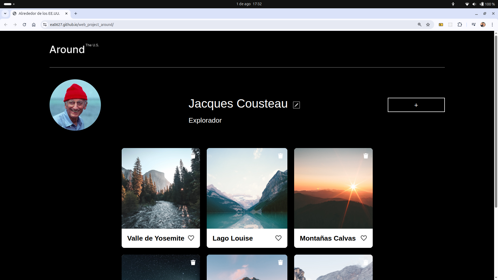

# 📸 Proyecto Sprint 9: Alrededor de los EE.UU.

Este proyecto representa una galería interactiva de fotografías con diseño responsivo, iniciada en el Sprint 7 del bootcamp de desarrollo web de **TripleTen**. Ha evolucionado hasta el Sprint 9, incorporando validaciones en formularios, modularización del código, y una mejor experiencia de usuario.

---

## 🔗 Vista en vivo

👉 [Ver el proyecto en GitHub Pages](https://ea0627.github.io/web_project_around/)

---

## ⚙️ Funcionalidades implementadas

- ✏️ Editar el perfil del usuario con validación de campos (nombre y ocupación).
- ➕ Agregar nuevas tarjetas mediante formulario validado (título + URL).
- ✅ Validación en tiempo real con mensajes nativos del navegador.
- 🔒 Botón de envío desactivado hasta que los campos sean válidos.
- 🖼️ Vista ampliada de imágenes al hacer clic.
- 🗑️ Eliminar tarjetas de la galería.
- ❤️ Marcar tarjetas como favoritas ("me gusta").
- ❌ Cierre de ventanas emergentes (popups) con tecla `Esc` y clic en el fondo.
- 🧼 Reset automático de validación al abrir formularios.
- 🧩 Modularización del JS: `validate.js`, `constants.js`, `index.js`

---

## 🛠️ Tecnologías usadas

- HTML5 + CSS3
- JavaScript (ES6)
- Responsive Design con Media Queries
- BEM (Block Element Modifier)
- Git + GitHub Pages

---

## 📁 Estructura del Proyecto

```
web_project_around/
├── blocks/             # CSS organizado por bloques BEM
├── images/             # Recursos gráficos
├── pages/              # CSS principal
├── scripts/
│   └── index.js        # Lógica principal del sitio
│   ├── validate.js     # Módulo de validación de formularios
│   └── constants.js    # Tarjetas iniciales exportadas como constante
├── index.html          # Archivo HTML principal
└── README.md
```

---

## 📸 Captura de pantalla



---

## 👨‍💻 Autor

**Eduardo Amaya**  
Desarrollador Web Junior  
Bootcamp TripleTen – Sprint 7  

📬 eduardo.amaya627@gmail.com  
🔗 [GitHub @ea0627](https://github.com/ea0627)

---

## 📌 Notas adicionales

- El sitio fue desplegado desde la rama `main` usando GitHub Pages.
- Todas las rutas fueron ajustadas para funcionar correctamente en producción.
- Se planea agregar mejoras como validación de formularios o almacenamiento local.

---

> Gracias por visitar este proyecto. ¡Seguimos creciendo con código! 💻✨